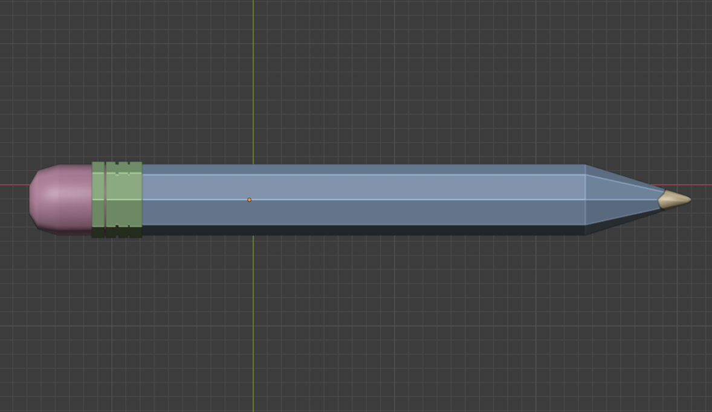
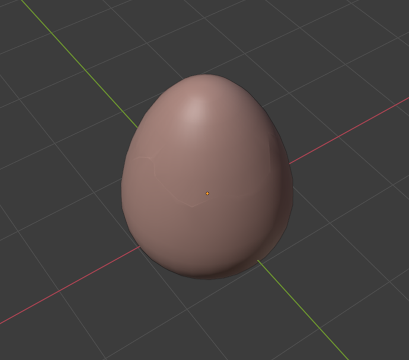
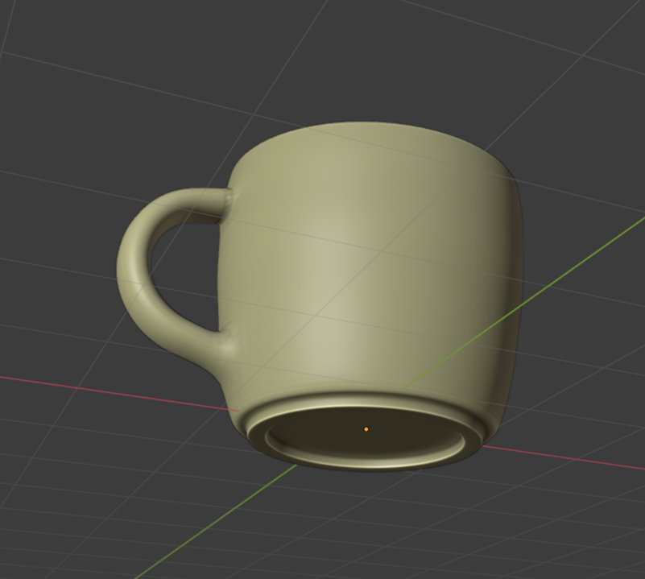

# 3D-Basic
 Some basic 3D object  when I started blender. (2020)

 ## Screen shot

### pencil
    

### shoes
    

### apples
    

### sunglass
    

### headphone
    

### egg
  

### pigibank
    

### hat
    

### dumbel
  

### tools
  

### mug
    

### spoon
  

## 3D file
* **[Pencil](https://github.com/XAbirHasan/Scale-3D-Blender/blob/master/3D%20file/scale.fbx)**
* **[shoes](https://github.com/XAbirHasan/Scale-3D-Blender/blob/master/3D%20file/scale.fbx)**
* **[apples](https://github.com/XAbirHasan/Scale-3D-Blender/blob/master/3D%20file/scale.fbx)**
* **[sunglass](https://github.com/XAbirHasan/Scale-3D-Blender/blob/master/3D%20file/scale.fbx)**
* **[headphone](https://github.com/XAbirHasan/Scale-3D-Blender/blob/master/3D%20file/scale.fbx)**
* **[egg](https://github.com/XAbirHasan/Scale-3D-Blender/blob/master/3D%20file/scale.fbx)**
* **[pigibank](https://github.com/XAbirHasan/Scale-3D-Blender/blob/master/3D%20file/scale.fbx)**
* **[hat](https://github.com/XAbirHasan/Scale-3D-Blender/blob/master/3D%20file/scale.fbx)**
* **[dumbel](https://github.com/XAbirHasan/Scale-3D-Blender/blob/master/3D%20file/scale.fbx)**
* **[tools](https://github.com/XAbirHasan/Scale-3D-Blender/blob/master/3D%20file/scale.fbx)**
* **[mug](https://github.com/XAbirHasan/Scale-3D-Blender/blob/master/3D%20file/scale.fbx)**
* **[spoon](https://github.com/XAbirHasan/Scale-3D-Blender/blob/master/3D%20file/scale.fbx)**

## Authors

* **AbirHasan**

Check out my other works [@XAbirHasan](https://github.com/XAbirHasan)
