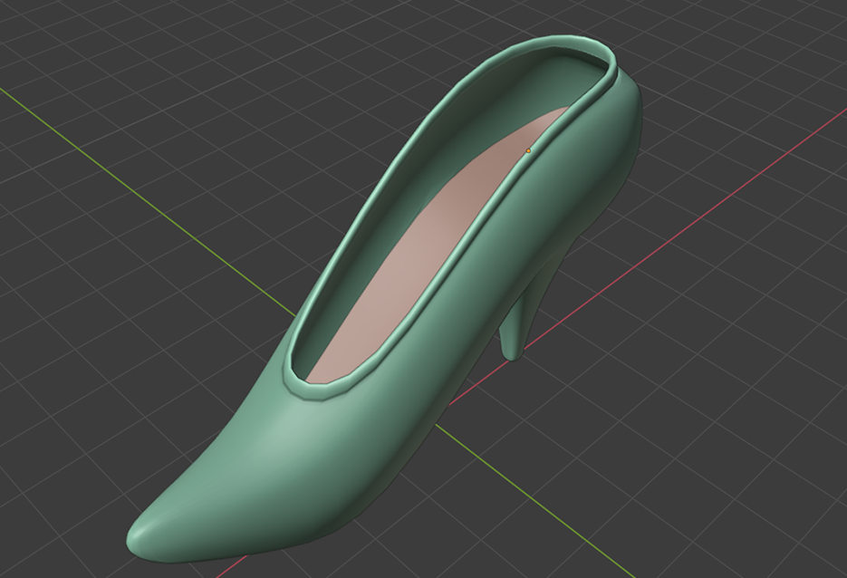
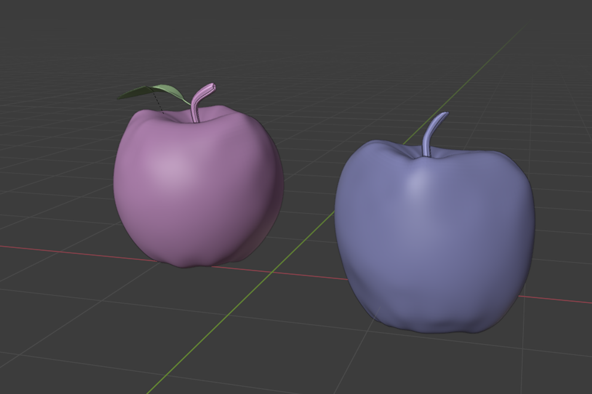
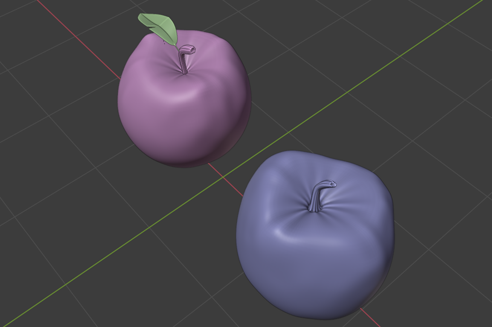
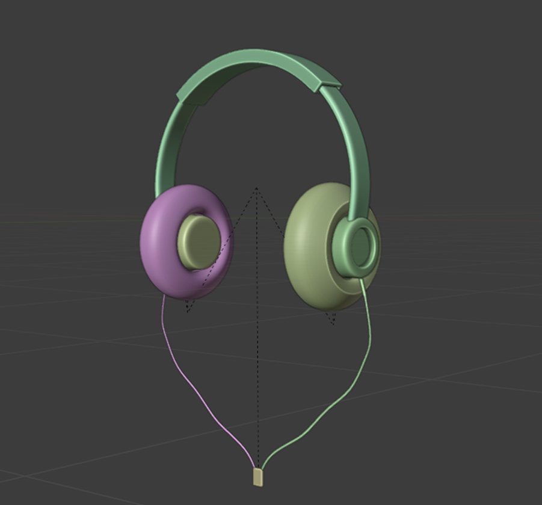
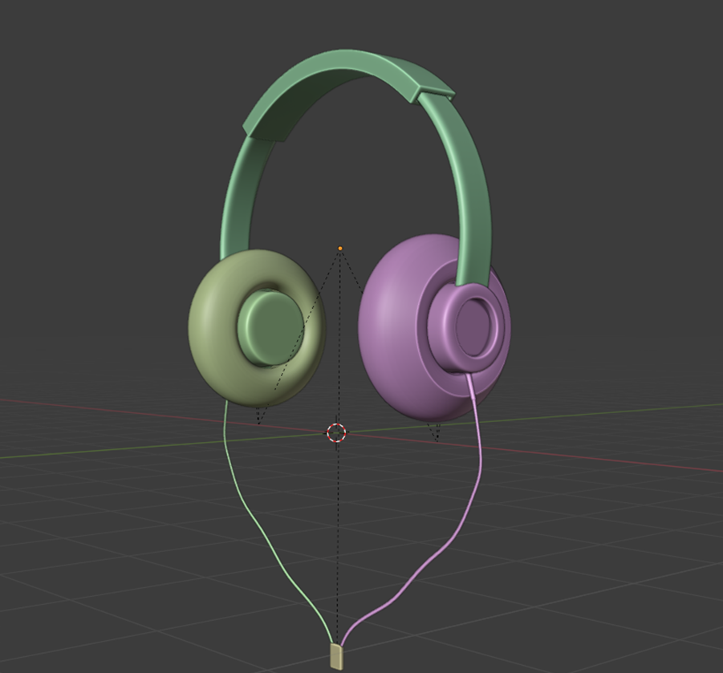
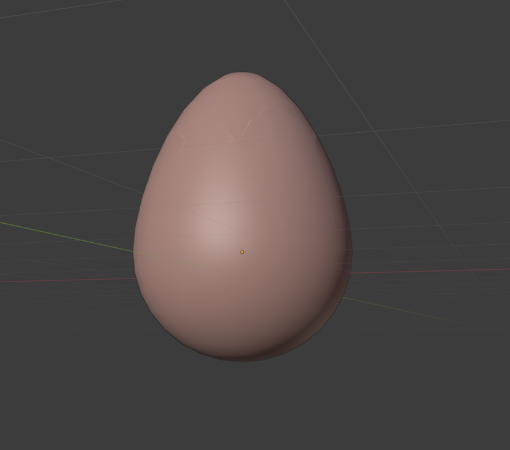
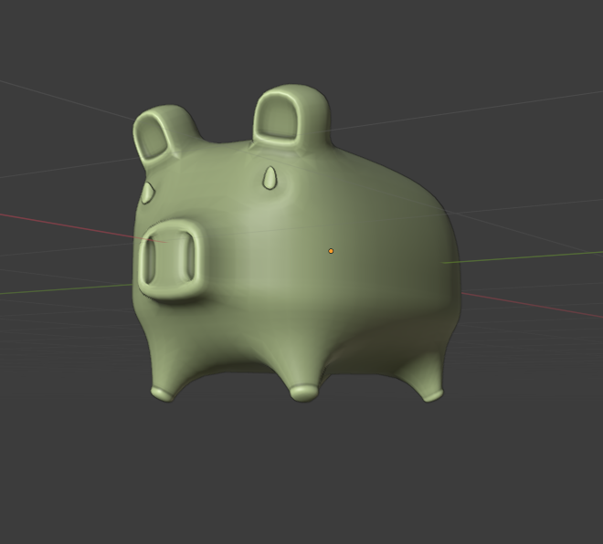
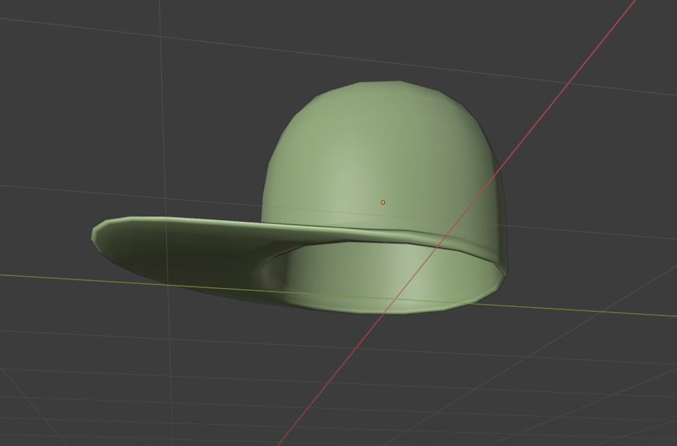
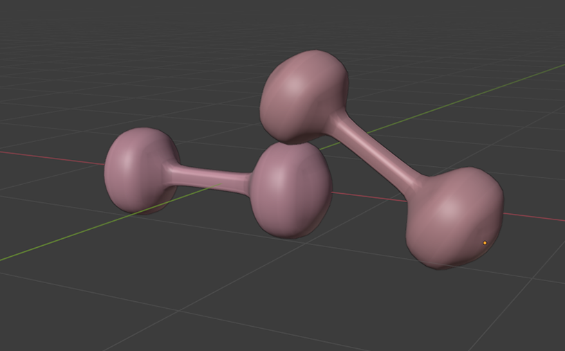
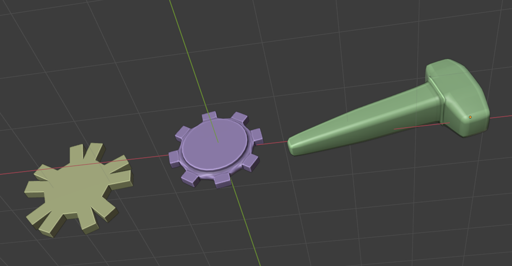

# 3D-Basic
 Some basic 3D object  when I started blender. (2020)

 ## Screen shot

### Pencil
    

### Shoes
    

### Apples
    

### Sunglass
    

### Headphone
    

### Egg
  

### Piggy Bank
    

### Hat
  

### Dumbbell
  

### Tools
  

### Mug
    

### Spoon
  

## 3D file
* **[Pencil](https://github.com/XAbirHasan/3D-Basic/blob/master/3d-file/pencil.fbx)**
* **[Shoes](https://github.com/XAbirHasan/3D-Basic/blob/master/3d-file/shoes.fbx)**
* **[Apples](https://github.com/XAbirHasan/3D-Basic/blob/master/3d-file/apples.fbx)**
* **[Sunglass](https://github.com/XAbirHasan/3D-Basic/blob/master/3d-file/sunglass.fbx)**
* **[Headphone](https://github.com/XAbirHasan/3D-Basic/blob/master/3d-file/headphone.fbx)**
* **[Egg](https://github.com/XAbirHasan/3D-Basic/blob/master/3d-file/egg.fbx)**
* **[Piggy Bank](https://github.com/XAbirHasan/3D-Basic/blob/master/3d-file/pigibank.fbx)**
* **[Hat](https://github.com/XAbirHasan/3D-Basic/blob/master/3d-file/hat.fbx)**
* **[Dumbbell](https://github.com/XAbirHasan/3D-Basic/blob/master/3d-file/dumbel.fbx)**
* **[Tools](https://github.com/XAbirHasan/3D-Basic/blob/master/3d-file/tools.fbx)**
* **[Mug](https://github.com/XAbirHasan/3D-Basic/blob/master/3d-file/mug.fbx)**
* **[Spoon](https://github.com/XAbirHasan/3D-Basic/blob/master/3d-file/spoon.fbx)**

## Authors

* **AbirHasan**

Check out my other works [@XAbirHasan](https://github.com/XAbirHasan)
